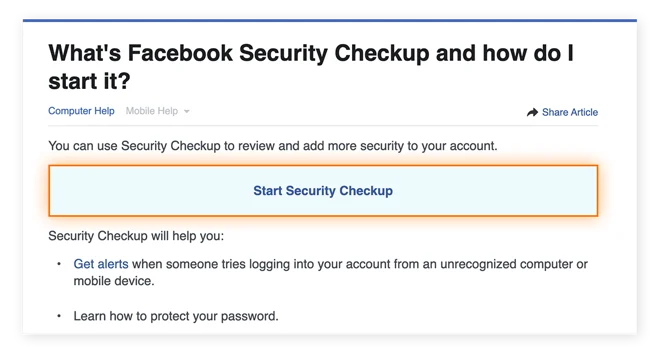

# **Accounts (Social Media, Email)**

Today, most of us are on social media. In fact, Pew Research found that nearly 7 out of 10 U.S. adults use at least one social media site. With so many people online, it’s easy to forget about the security risks. We also feel a lot of pressure to be part of it.

But you don’t have to choose between being active on social media and being safe. You can do both by learning about the dangers and setting up your privacy controls. In the guide below, We’ll explain common risks and give you simple tips to protect your social media accounts.

# Common Risks⚠️ 

!>Think before you post.

Here are the most common risks you'll find across all social media platforms. A big part of the risk is how you should think before you post, because how big of an impact your post can be.

- **Everything Can Become Public**: Assume anything you post has the potential to be public and permanent.The internet makes it incredibly difficult, if not impossible, to truly take something back once it's been shared.
- **Misinterpretation and Lack of Context**: Comments can easily be taken out of context online. Since text often lacks emotional cues, misunderstandings can quickly lead to regret. 
- **Professional Impact**: Consider how your online presence might appear to prospective employers or clients. Your digital footprint can significantly influence professional opportunities.
- **Inadequate Privacy Controls**: Most social media sites have privacy settings that let you control who can see what you post. Take a few minutes to check and change these settings on each site to make sure you're comfortable with who can see your information.
- **Deceptive Connections**: Spam accounts can be very convincing, and once they're in your network, they might connect with you in multiple ways. While everyone has different comfort levels with connecting to people they don't know personally, make sure you're making that choice consciously.
- **Personal Information Vulnerabilities**: Social media profiles are rich sources of personal information that attackers can exploit for hacking other accounts, social engineering scams, and more. Before sharing, consider how that information could potentially be used against you.
- **Client Confidentiality**: If your work requires confidentiality, be extremely vigilant. Ensure your personal social media posts don't inadvertently breach client confidentiality.

---

# Facebook👍

Here's how to lock down your Facebook account without feeling locked out of social life.

## Adjust Your Privacy Settings. 
Your privacy settings are your first and best line of defense. Most of us don't bother to check them, but they are crucial for controlling **who sees your content**. Take a few minutes to review and adjust these settings to ensure you are only sharing with the people you want to. 

Facebook offers a guided tool that simplifies the process of reviewing your settings. You can access the tool [here](https://www.facebook.com/help/securitycheckup), and manage it by following this guide below:

1. Access your Settings & Privacy menu.
2. Select Privacy Checkup.
3. Follow the prompts to review and adjust who can see your profile information, posts, apps you've logged into with Facebook, and more.

## Turn on Two-Factor Authentication (2FA). 
One of the simplest yet most powerful steps you can take is to turn on two-factor authentication (2FA). This means that even if someone steals your password, they can't get into your account. 

Here's how it works: when you try to log in from a new device, Facebook sends a code to your phone. You need both your password and that code to get in. The setting to set this up, is in your Settings & Privacy menu.

**How to Turn on 2FA on Facebook**

!>Read [here](/Guides/Accounts/2FA.md) about 2FA

1. Go to Settings: Log in to your Facebook account. Click on the menu icon (your profile picture or three horizontal lines) in the top-right corner.
2. Find Security: In the dropdown menu, select Settings & Privacy, then click Settings. Look for Security and Login in the left-hand menu.
3. Choose 2FA: Scroll down and find Use two-factor authentication. Click on it to get started.
4. Pick a method: You will be asked to choose how you want to receive your security codes.
    - Authentication App: This is the most secure option. Apps like Google Authenticator or Authy generate a new code every 30 seconds, which is more reliable than text messages.
    - Text Message (SMS): This is the easiest method. Facebook will send a code to your phone number via text.
    - Security Key: This is a physical device that you plug into your computer to log in.
5. Follow the steps: Facebook will walk you through the final steps. This will include verifying your phone number or scanning a QR code with your chosen app to link it to your account.

!> ⚠️Warning: Save Your Backup Codes!

Once you have set up 2FA, Facebook will give you a list of backup codes. This is a critical step that many people forget.

**What they are**: These are special, one-time-use codes that you can use to log in if you lose your phone or can't get your security code for any reason.

**What to do with them**: Write down these codes and store them in a safe place. Do not store them on your phone, because if you lose the phone, you've lost your access to your account. Consider saving them in a secure password manager or on a piece of paper in a locked drawer.

!> complicated? we can help with that. check the [help](/Help/Help.md) pages!

## Manage Your Profile and Friends. 
Think of your online profile as your house. You wouldn't just open your front door to a stranger who says they know your neighbor, right? The same goes for friend requests. Even if someone has mutual friends, if you don't know them in real life, it's best to not accept their request. 

Scammers often use fake profiles to send messages that look real to trick you. Be cautious of messages from friends that seem unusual, like a request for money, as their account might have been hacked. Never click on suspicious links in a message or post if you're not sure where they lead. Also, be wary of fake giveaways or too-good-to-be-true offers, as these are almost always scams.

---

# Instagram📸

## Making Your Instagram Account Private
By default, anyone can see your Instagram posts, follow you, and see who you follow. To have more control over who sees what you share, it's a good idea to make your account private.

Here's a simple, step-by-step guide to doing just that. (both Ios/Apple and Android have the same steps)

1. Go to Your Profile First, open the Instagram app and tap on your profile picture in the bottom-right corner. This will take you to your personal profile page.
2. Open the Settings Menu Next, look for the three horizontal lines (the "hamburger" menu) in the top-right corner of your screen and tap on it. A menu will pop up from the bottom.
3. Find "Settings and privacy" From the pop-up menu, select the option that says "Settings and privacy." This is where you'll find all the controls for your account.
4. Go to "Account privacy" On the "Settings and privacy" page, scroll down until you see the section for "Who can see your content." Tap on "Account privacy."
5. Toggle "Private Account" On You'll see a switch next to "Private Account." Simply tap on this switch to turn it on. Instagram might give you a quick heads-up about what this means for your followers. Just confirm, and you're all set!

## Review tagged photos 

If you've ever been tagged in a photo you don't want on your profile, this guide is for you. Instagram gives you control over which tagged photos appear on your profile. You can either hide them or manually approve them before they show up.

Here's how to do it, step-by-step.

1. Go to Your Settings by opening the Instagram app and tap your profile picture in the bottom-right corner.Tap the three horizontal lines (the "hamburger" menu) in the top-right corner. Select Settings and privacy from the menu.
2. Find the "Tagged Content" Settings. On the "Settings and privacy" screen, scroll down until you see the section for "How others can interact with you." Tap on "Tags and mentions."
3. Choose How to Manage Tags. You'll see two options under "Who can tag you." The one you want for this purpose is "Manually approve tags."

*Option 1: Manually approve tags (Recommended).*

Tap the "Manually approve tags" toggle to turn it on.
From now on, when someone tags you in a photo, it won't automatically appear on your profile. You'll get a notification, and you can go to your "Tagged" tab on your profile and choose to approve or hide the photo.

*Option 2: Hide a tag that's already on your profile*

Go to your profile and tap the "Tagged" tab (the icon that looks like a person's silhouette inside a box).
Tap the photo you want to hide.
Tap the three dots in the top-right corner of the photo.
Select "Tag options," then choose "Remove me from post" to remove the tag completely, or "Hide from my profile" to just hide it from your profile while keeping the tag active.

## Control Story sharing 
Controlling your story settings is crucial for both privacy and content control. By managing who can view and reply to your stories, you ensure your content is seen only by your intended audience, such as a "Close Friends" list. It also allows you to prevent others from sharing your stories on their own pages, which helps you maintain control over your content and its reach.

How to Control Your Instagram Story Privacy
1. Open Story Settings:
- Open the Instagram app and tap your profile picture in the bottom right corner.
- Tap the Menu icon (three horizontal lines) in the top-right corner.
- Select Settings and activity.

2. Access Story Controls:

- Scroll down to the section titled "Who can see your content."
- Tap on Sharing and remixes.

3. Adjust Your Privacy Settings:

- From here, you will find options to manage who can see and interact with your stories.
- Hide Story From: Tap here to select specific people you do not want to see your stories.
- Allow sharing to story: This is a key setting. You can turn this off to prevent others from sharing your posts and Reels to their stories.
- Allow sharing to messages: You can also turn this off to prevent people from sharing your stories in private messages.

## Two-Factor Authentication

!>Read [here](/Guides/Accounts/2FA.md) about 2FA

Turning on two-factor authentication (2FA) is one of the most important steps you can take to secure your Instagram account. It adds an extra layer of protection, making it much harder for someone to hack you even if they have your password.

**How to enable 2FA on Instagram**

1. Access Your Security Settings
- Open the Instagram app and go to your profile.
- Tap the Menu icon (three horizontal lines) in the top-right corner.
- Tap Settings and privacy.
- In the menu, tap Accounts Center (this is Meta's central hub for settings).
- Tap Password and security.

2. Choose Your 2FA Method
- Tap Two-factor authentication and then select your Instagram account.
- You will be prompted to choose a security method:
- Authentication App (Recommended): This is the most secure option. It uses a third-party app like Google Authenticator or Duo Mobile to generate a unique login code every 30 seconds.
- Text Message (SMS): You will receive a code via text message to your phone number. This is easy, but it can be less secure if your phone number is compromised.
- WhatsApp: You can receive your login codes via WhatsApp messages.

3. Complete the Setup
- Follow the on-screen instructions for your chosen method.
- If you choose an Authentication App, Instagram will give you a key to copy and paste into your app.
- If you choose Text Message, Instagram will send a verification code to your phone.
- Enter the code from your chosen method to confirm and finalize the setup.

!> ⚠️Warning: Save Your Backup Codes!

Once you have set up 2FA, Facebook will give you a list of backup codes. This is a critical step that many people forget.

**What they are**: These are special, one-time-use codes that you can use to log in if you lose your phone or can't get your security code for any reason.

**What to do with them**: Write down these codes and store them in a safe place. Do not store them on your phone, because if you lose the phone, you've lost your access to your account. Consider saving them in a secure password manager or on a piece of paper in a locked drawer.

!> complicated? we can help with that. check the [help](/Help/Help.md) pages!

---

# LinkedIn💼

## Customize public profile

By customizing which parts of your profile are visible to the public, you can control your narrative and ensure that you're only sharing what you're comfortable with. It's an important step in managing your digital identity and a great way to put your best foot forward in the professional world.

**How to Customize Your Public LinkedIn Profile**
1. Go to Your Public Profile Settings
- Log in to your LinkedIn account.
- Click on your profile photo in the top-right corner of the homepage.
- From the dropdown menu, select "Settings & Privacy."

2. Navigate to Visibility Settings
- In the left-hand sidebar, click on "Visibility."
- Under the "Visibility of your profile & network" section, click on "Edit your public profile." This will open a new tab with your public profile settings.

3. Review and Customize Your Public Profile Visibility
- On the right-hand side of the page, you'll see a box titled "Edit visibility."
- Here, you can choose how much of your profile is visible to the public. You have two main options:
*Public*: Your full profile is visible.

*Your Network*: Only people in your network can see your profile.

You can also scroll down and individually choose which sections of your profile are visible to the public. You will see a list of sections like: Profile photo, Full name, Number of connections, Summary, Current experience, Skills. For each section, use the toggle switch to turn its public visibility on or off.

4. Save Your Changes
There's no save button. As you make changes, the settings are automatically applied.

## Control contact visibility: 
Decide whether your contacts can be viewed by the public, your network, or only you. I suggest restricting this to "only you" to **reduce unsolicited sales and marketing attempts** targeting your connections.

## Enable 2FA
Don't miss this crucial security feature, even though it's somewhat hidden at the bottom of the **Privacy** section.

!>Read [here](/Guides/Accounts/2FA.md) about 2FA
